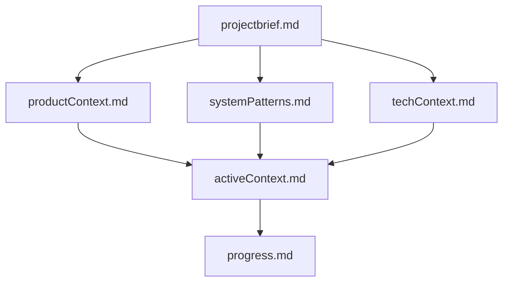

# Memory Bank - PDF Service Go

## 🧠 Что это такое

Memory Bank - это система документации, которая сохраняет контекст проекта между сессиями работы. Каждый файл содержит ключевую информацию, необходимую для понимания проекта.

## 📁 Структура файлов

### Основные файлы (обязательные)
1. **[projectbrief.md](projectbrief.md)** - Фундаментальный документ с целями и требованиями
2. **[productContext.md](productContext.md)** - Проблемы, которые решает проект, и пользовательский опыт
3. **[systemPatterns.md](systemPatterns.md)** - Архитектурные паттерны и ключевые компоненты
4. **[techContext.md](techContext.md)** - Технологический стек и конфигурация
5. **[activeContext.md](activeContext.md)** - Текущий фокус работы и недавние изменения
6. **[progress.md](progress.md)** - Статус готовности всех функций

## 🔄 Иерархия документов



## 🎯 Как использовать

### При начале работы
1. Прочитайте **projectbrief.md** для понимания целей
2. Изучите **activeContext.md** для понимания текущего состояния
3. Проверьте **progress.md** для понимания что готово

### При внесении изменений
1. Обновите **activeContext.md** с новыми изменениями
2. Обновите **progress.md** если завершены новые функции
3. При архитектурных изменениях обновите **systemPatterns.md**

### При добавлении новых технологий
1. Обновите **techContext.md** с новыми зависимостями
2. Обновите **systemPatterns.md** если изменились паттерны

## 📊 Текущий статус (Декабрь 2024)

### ✅ Завершено
- **Система отслеживания ошибок**: Полная реализация с веб-интерфейсом
- **Автоматизация развертывания**: Makefile с 20+ командами
- **Мониторинг**: Prometheus + Grafana + Jaeger
- **Инфраструктура**: Kubernetes deployment в test/prod

### 🔄 В работе
- Оптимизация производительности
- Расширенный мониторинг с алертами

### 📋 Планируется
- Аутентификация и авторизация API
- Дополнительные форматы документов
- Batch processing

## 🚀 Быстрые команды

```bash
# Развертывание
make new-version && make deploy ENV=prod

# Проверка системы
make test-error-system ENV=prod

# Получение URL
make get-service-url ENV=prod

# Мониторинг
make status ENV=prod && make logs ENV=prod
```

---

**Готовность к продакшну: 95%** ✅

Проект готов к использованию с полной системой отслеживания ошибок и автоматизацией развертывания.